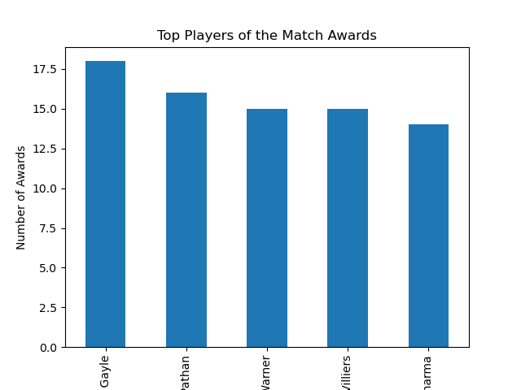
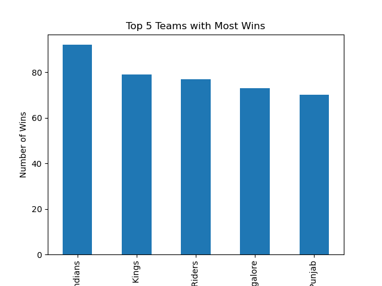
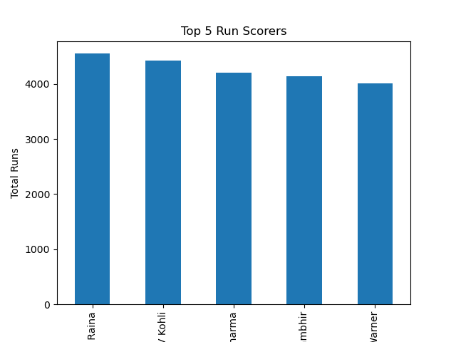
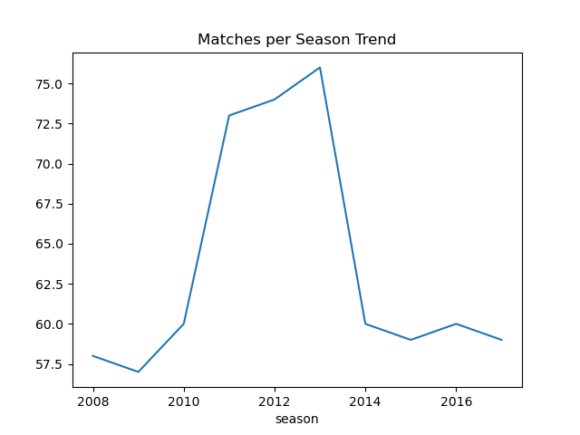
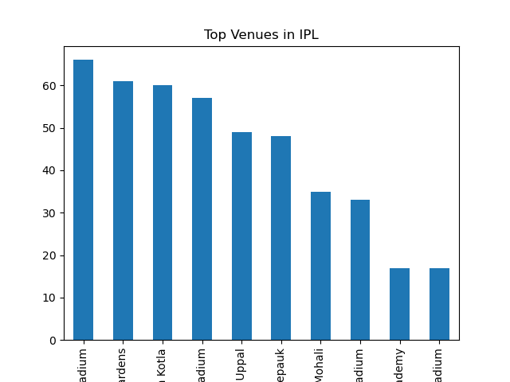
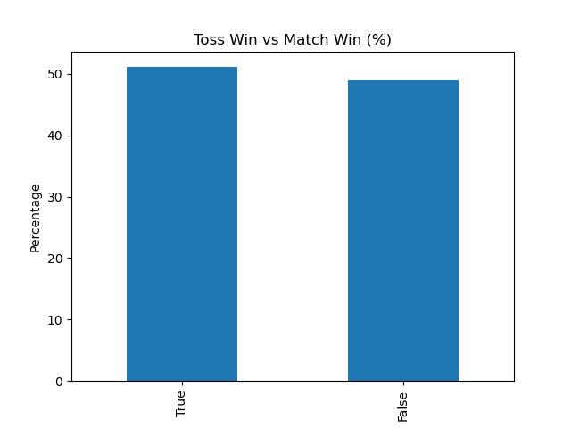

IPL Data Analysis: Storytelling & Advanced Analytics

##  Project Overview
This project analyzes historical Indian Premier League (IPL) data using Python. It starts with basic exploratory data analysis (EDA) and evolves into advanced analytics, including feature engineering, multi-variable analysis, and simple predictive modeling.
The goal is to understand team performance, player efficiency, match patterns, and factors influencing match outcomes.

 ## Project Evolution
This repository includes two levels of analysis:
# Version 1: Basic EDA
Data cleaning and preprocessing
Team performance analysis
Player of the match analysis
Toss impact (basic comparison)
Season-wise match trends
Venue frequency analysis

# Version 2: Advanced Analytics Upgrade
Feature Engineering:
Batting Strike Rate
Bowling Economy Rate
Statistical Thinking:
Toss win vs match win probability
Multi-variable analysis (venue + toss + winner)
Predictive Thinking:
Rule-based match winner prediction model
Business Insights:
Decision-making simulation for toss strategy

## Tools & Technologies
Python | Pandas | NumPy | Matplotlib | Seaborn | Jupyter Notebook

## Key Insights
Team consistency is more important than winning the toss
Player performance is better measured using efficiency metrics (strike rate, economy rate)
Venue and toss together influence match outcomes
IPL data can be used for simple predictive modeling
Data-driven insights help in strategic decision-making

## Business Value
This project demonstrates how raw sports data can be transformed into actionable insights. Similar techniques are used in:
Sports analytics (team strategy)
Business decision-making
Performance optimization systems
Predictive modeling frameworks

## Images

## TOP 5 PLAYER OF THE MATCH AWARDS

## TOP5_TEAMS_WITH_MOSTWINS

## TOP5_RUNSCORERS

## Top5_wicket_takers

## Toss_win_vs_match_win

## MATCHES_PERSEASON_TREND

## topvenues in ipl

## percentage_of_toss_vs_match_wins

## Conclusion
This project evolves from basic data exploration to advanced analytical thinking. It demonstrates progression in data analysis skills, feature engineering, and business insight generation.

## Future Improvements
Machine Learning model for match prediction
Player rating system
Power BI interactive dashboard
Real-time IPL analytics system

 Author Note
This project represents a learning journey from basic data analysis to advanced data science thinking, focusing on real-world analytical problem-solving.
