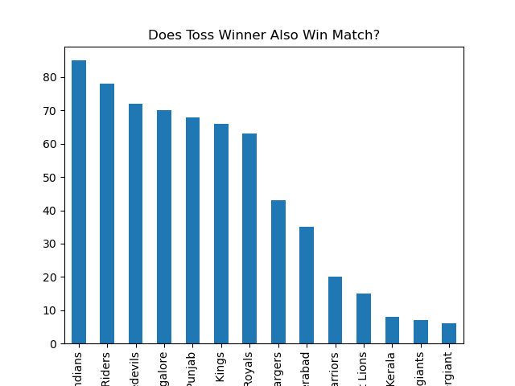
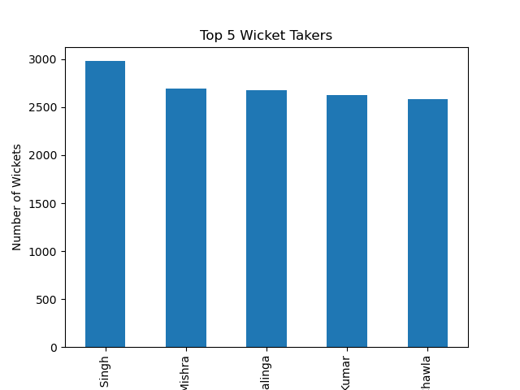

IPL Data Analysis - Storytelling with Data

## Overview
This project analyzes historical data from the Indian Premier League (IPL) to uncover meaningful insights using data analysis 
and visualization techniques.The analysis focuses on team performance, player contributions, and match outcomes.

## Tools & Technologies
- Python
- Pandas
- Matplotlib
- Jupyter Notebook

 ## Dataset : The dataset consists of:
- matches.csv → Match-level information
- deliveries.csv → Ball-by-ball data.

  ## Project screenshots
  # WINNER TEAMS TOP 5
  
  # Top 5 run scrorer
  )
  # toss impact
   
  # highest wicket taker
   

  ## Key Insights
- Mumbai Indians has the highest wins, showing long-term consistency.
- Suresh Raina is among top run scorers → reliable batsman
- Harbhajan Singh is among top wicket-takers → effective bowler
- Toss does not guarantee victory → skill matters matters
- 
## How This Project Is Useful
“This project demonstrates how raw data can be transformed into actionable insights. For example, I analyzed team and player performance, validated assumptions like toss impact, and identified winning strategies. The same approach is used in real-world scenarios like identifying top products, optimizing business strategies, and making data-driven decisions.”

## Conclusion
The analysis shows that consistent performance and player contribution are the key drivers of success, while factors like
toss have limited impact.This highlights the importance of data-driven decision-making over assumptions.
